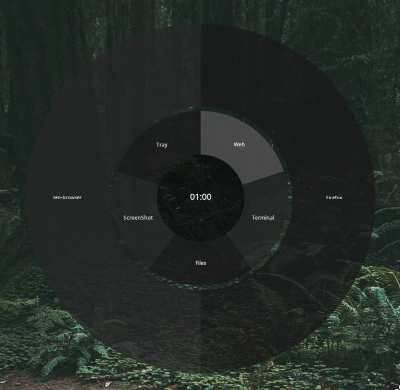

# Waypie

[](LICENSE)
[](https://www.rust-lang.org)
[](https://wayland.freedesktop.org/)
[](https://archlinux.org)

**Waypie** is a high-performance, Rust-based desktop HUD and utility **for Arch Linux on Wayland** (Sway/Hyprland). It provides an interactive 2-level radial menu with smooth animations and deep system integration.



### Key Features

- **Interactive 2-Level Radial Menu:** Smooth animations with categories (Inner Ring) and sub-actions (Outer Ring).
- **Advanced System Tray (SNI) Support:** Hybrid Watcher (Server/Client) with recursive D-Bus introspection and integrated `DBusMenu` support.
- **Cursor Auto-Centering:** Teleports the cursor to the center of the HUD upon activation using `wlr-virtual-pointer-v1`.
- **Custom Shell Script & Command Execution:** Spawns detached processes for applications, shell commands, or scripts.
- **Wayland Native:** High-performance overlay positioning using `gtk4-layer-shell`.
- **Hot-Reloading Configuration:** Instant UI and menu updates when the configuration file is modified.
- **Real-time Clock:** Integrated clock display in the middle of the wheel.

### Configuration

Waypie is configured via a `config.toml` file located at `~/.config/waypie/config.toml`.

#### Example `config.toml`

```toml
[ui]
width = 800
height = 800
center_radius = 100.0
inner_radius = 200.0
outer_radius = 400.0

# Colors (RGBA or RGB)
# Values are 0.0 to 1.0
[ui.colors]
center_color = [0.0, 0.0, 0.0, 0.5]
text_color = [1.0, 1.0, 1.0]
stroke_color = [0.0, 0.0, 0.0]

# Ring Colors
inner_ring_color_even = [0.1, 0.1, 0.1, 0.8]
inner_ring_color_odd = [0.15, 0.15, 0.15, 0.8]
inner_ring_color_hover = [0.2, 0.2, 0.2, 0.9]
inner_ring_color_active = [0.3, 0.3, 0.3, 0.9]

outer_ring_color_even = [0.1, 0.1, 0.1, 0.8]
outer_ring_color_odd = [0.15, 0.15, 0.15, 0.8]
outer_ring_color_hover = [0.2, 0.4, 0.8, 0.9]

[[menu]]
label = "Web"
icon = "web-browser"
action = ""

[[menu.children]]
label = "Firefox"
icon = "firefox"
action = "firefox"

[[menu.children]]
label = "Zen"
icon = "zen-browser"
action = "zen-browser"

[[menu]]
label = "Terminal"
icon = "utilities-terminal"
action = "ghostty"

[[menu]]
label = "Files"
icon = "system-file-manager"
action = "thunar"

# Example: Inline shell command
[[menu]]
label = "Say Hi"
icon = "user-info"
action = "notify-send 'Waypie' 'Hello from the radial menu!'"

# System Tray Integration
[[menu]]
label = "Tray"
icon = "emblem-system"
action = ""
type = "tray"
```

### Installation

#### Building from source

```bash
git clone https://github.com/vkkkv/waypie
cd waypie
cargo build --release
./target/release/waypie
```

**Dependencies**

Ensure you have the following installed:
- `gtk4`
- `gtk4-layer-shell`
- `wayland`
- `wayland-protocols`

### License

Licensed under GPLv3
